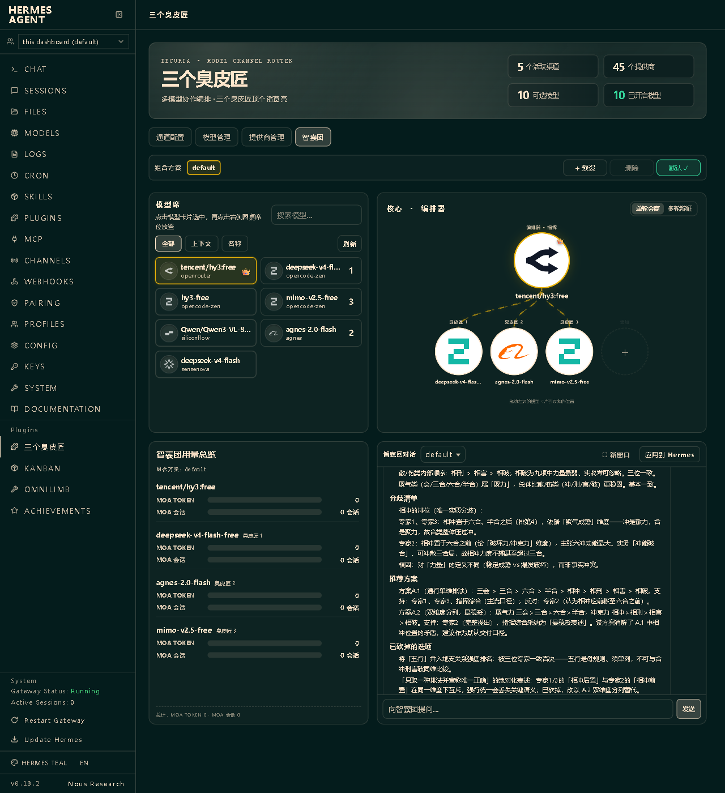
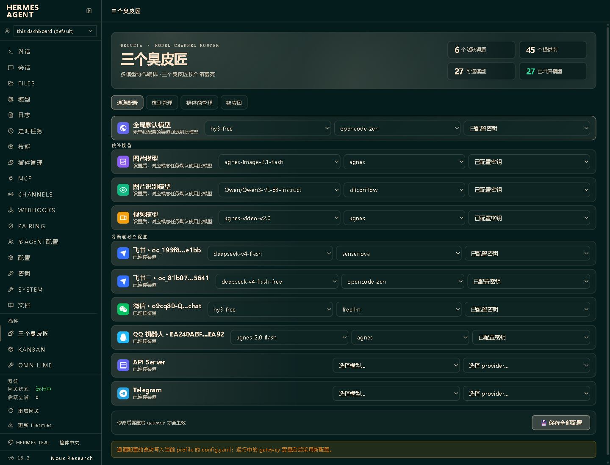
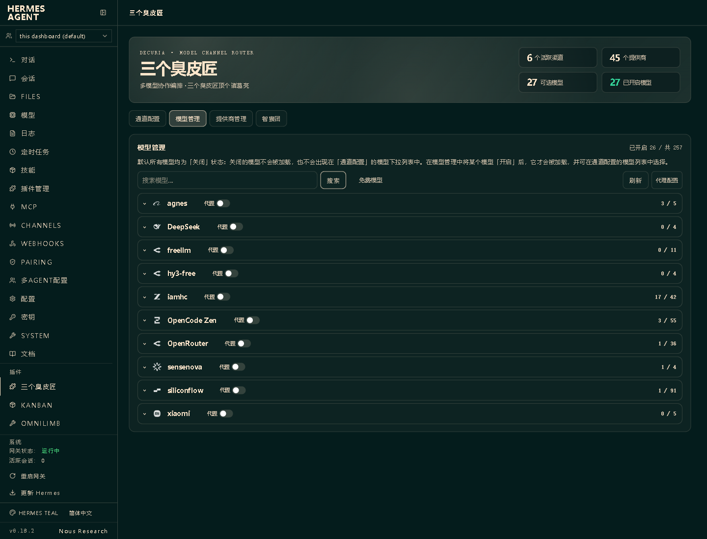
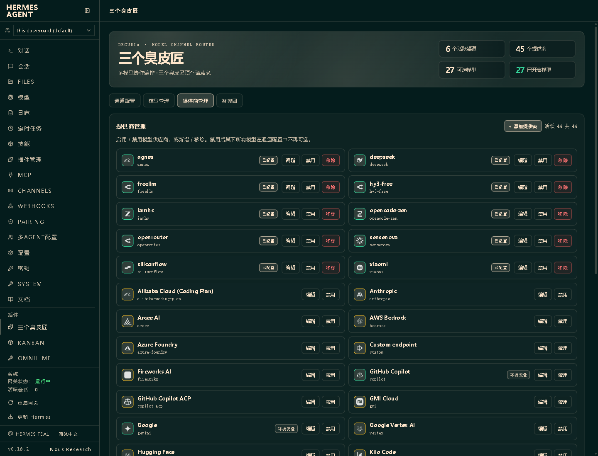

# Decuria · A Council of Minds

<p align="center">
  <a href="https://github.com/seanyang1983/decuria/actions/workflows/ci.yml"></a>
  <a href="LICENSE"></a>
  
  
  <a href="https://decuria.omnilimb.com"></a>
</p>

<p align="center">
  <a href="README.md">简体中文</a> · <b>English</b>
</p>

> Three cobblers with their wits combined surpass the master strategist.
> Let several AIs cover each other and push back — turn "ask one model" into "convene a panel of experts."

Decuria is a standalone Dashboard plugin for [Hermes Agent](https://github.com/NousResearch/hermes-agent). It brings **multi-model round-table collaboration, per-channel model routing, provider management, and model-visibility control** into a single panel — without changing a single line of Hermes core. Install it and go.

---

## More models, somehow more work. Why?

Once you wire up many models, the real time sink usually isn't "asking AI" — it's "managing AI":

- **Scattered config**: Want WeChat, Feishu and Telegram to each use a different model? You keep editing `config.yaml`, one change and one restart at a time.
- **Scattered credentials**: Providers, base URLs and multiple API keys live all over the place; each new model needs a manual check of what actually works.
- **Bloated lists**: The model list keeps growing, and the handful you actually use gets buried.
- **Single-model blind spots**: Even the strongest model has blind spots, bias and hallucinations — yet critical decisions often rely on it alone.
- **Slow, costly collaboration**: To cross-check a few models you copy the question around by hand, paste back and forth, and summarize manually — slow and token-hungry.
- **Coarse proxy control**: Some providers must go through a proxy, others must connect directly; a single global proxy is not enough.

Decuria folds these pain points into four pages: **configure once, see clearly, collaborate on demand, route per channel.**

---

## Four pages, four classes of problems solved at once

### 1. Council — let models cover each other, not just one answer



The Council builds on **Hermes Agent v0.18.2's native Mixture-of-Agents (MoA)** capability, turning collaboration that used to be driven only by config files into a **drag-and-drop, fully visual expert round table**.

Drag models into the "expert seats" and the "conductor seat" to form a round table: **up to 8 experts answer in parallel and independently, then a single conductor model synthesizes consensus, disagreement and recommendations** into a final conclusion.

```text
Your question
  ├─ Expert A: lays out facts and evidence
  ├─ Expert B: raises risks and counter-examples
  ├─ Expert C: proposes a plan and how to ship it
  └─ More experts (up to 8)
          ↓
      Conductor model adjudicates
          ↓
   Final conclusion / consensus report
```

On top of native MoA, Decuria adds a full visual and orchestration experience:

- **Drag-and-drop round table**: who plays, who conducts, how many experts — set it by dragging, no config file editing.
- **Clear expert / conductor seats**: the layout shows every role at a glance.
- **Single round / multi-round debate**: single round answers once and the conductor summarizes (fast and cheap); multi-round (2–5) lets experts see the previous round and keep challenging and refining, with an optional "early stop on high consensus" so it converges without wasting calls.
- **Usage overview**: see how many tokens each expert and the conductor consumed, so cost is transparent.
- **One-command convening from messaging**: trigger the Council with a keyword in an authorized channel, sharing the same round table and debate settings as the Dashboard.

### 2. Channel routing — the right model for every entry point



Configure the global default model, each messaging channel, and image / vision / video fallback models — all on one page. Model, provider and key cascade together and save in one batch. No more hand-editing config files and restarting one by one.

### 3. Model management — only the models you actually need



Models are grouped by provider, searchable, and filterable to free-only. A new provider's models are **all OFF by default** — you turn on only what you use; models discovered by a later refresh also stay OFF by default, so the list never floods.

### 4. Provider management — compatible endpoints with a full management experience



Add, edit, enable or disable any OpenAI-compatible provider, with custom base URLs, **multiple API keys per provider**, and a **per-provider proxy toggle**. API keys return an irreversible preview only — plaintext is never handed back.

---

## Install

> Repository: `https://github.com/seanyang1983/decuria`

### As a pip package

```bash
pip install decuria && hermes plugins enable decuria
```

> Two steps in one: `pip install` downloads the plugin code; `hermes plugins enable` adds `decuria` to the `plugins.enabled` allow-list in `config.yaml`. Hermes does not auto-load third-party plugins by default, so enabling and restarting the Gateway activates it.

### Or as a directory plugin

```bash
# macOS / Linux
git clone https://github.com/seanyang1983/decuria.git ~/.hermes/plugins/decuria && hermes plugins enable decuria
```

```powershell
# Windows PowerShell (PowerShell 5.1 doesn't support &&, so two steps)
git clone https://github.com/seanyang1983/decuria.git "$HOME\.hermes\plugins\decuria"
hermes plugins enable decuria
```

Restart the Gateway, and start the Dashboard when needed:

```bash
hermes gateway restart
hermes dashboard
```

Open the Dashboard and enter "**A Council of Minds**" from the sidebar. Full walkthrough: [User guide](docs/INTRO.md).

## 5-minute start

1. In **Provider management**, confirm your providers and credentials.
2. In **Model management**, refresh the catalog and enable only the models you plan to use.
3. In **Channel routing**, set the global, per-channel and multi-modal fallback models.
4. In **Council**, drag in experts and a conductor, and pick single or multi-round.
5. Ask from the Dashboard, or convene directly from an authorized messaging channel.

## Convening the Council from messaging

Channel users authorized through Hermes allowlist / pairing can convene the Council with a trigger word (case-insensitive for the English ones):

`智囊团` · `智囊` · `MoA` · `专家团` · `专家圆桌` · `混合智能` · `mixture of agents`

```text
智囊团 evaluate this plan from product, engineering and business angles
MoA compare the risk, benefit and implementation cost of A vs B
专家圆桌 run a devil's-advocate review for this launch
智囊团[preset] analyze this question
```

Messaging and the Dashboard share the same round-table models and debate settings; at most 2 channel tasks run at once, and duplicate requests get a busy notice. Multi-round debate significantly increases call volume — use it according to task value.

## Security & privacy

- **Keys never leak**: normal responses return an irreversible preview only; plaintext is refilled only during authenticated edits, and is never cached.
- **Controlled outbound requests**: URLs, target addresses and every redirect are validated; authenticated requests cannot cross origins; JSON, image, video and Base64 decoding all have size caps.
- **Safe writes**: config and state use locks, temp files, `fsync` and atomic replace.
- **Authorization & isolation**: channel triggers reuse Hermes' allowlist / pairing and are closed to unauthorized users; runtime data is isolated per profile under `<HERMES_HOME>/data/decuria/`, never polluting the plugin source directory.

If any key has appeared in a log, screenshot or commit history, rotate it in the provider console immediately. Reporting process: [SECURITY.md](SECURITY.md).

## Development & verification

```bash
python -m py_compile state_paths.py security_utils.py __init__.py moa_core.py moa_trigger.py media_tools.py dashboard/plugin_api.py
python -m unittest discover -s tests -v
node --check dashboard/dist/index.js
```

The frontend is a build-free Preact IIFE; backend changes require restarting the Dashboard / Gateway. The plugin API is mounted at `/api/plugins/decuria`.

## License

Decuria is released under [GNU AGPL-3.0](LICENSE). Copyright © 2026 Decuria Team.

- **Personal, learning, research, and equally open-source projects**: free to use, modify and distribute. But if you modify Decuria and **provide it as a network service** (including private deployment for others), you must make the **complete source of your modified version** available to those users (AGPL §13).
- **Closed-source or commercial integration**: if you do not want to open-source your changes (e.g. integrating Decuria into a closed product or commercial service), contact the author for a **commercial license** (dual licensing).

Third-party assets (bundled Preact, provider icons, etc.) keep their respective original licenses; see [THIRD_PARTY_NOTICES.md](THIRD_PARTY_NOTICES.md). Brand names and trademarks belong to their respective owners.
